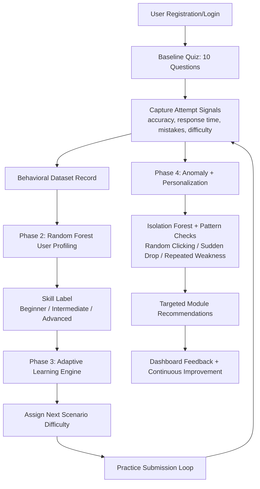

# PhishGuard AI

PhishGuard AI is an adaptive phishing-awareness training platform.

It uses simulated phishing scenarios, machine learning, and continuous feedback to improve each user’s detection ability over time.

---

## What this app does

- Runs a **10-question baseline quiz** using realistic email scenarios.
- Records **accuracy, response time, mistake types, and attempted difficulty**.
- Builds a behavioral dataset for each user session.
- Classifies user skill with a **Random Forest** model (`beginner`, `intermediate`, `advanced`).
- Uses an adaptive engine to **adjust scenario difficulty dynamically**.
- Uses **Isolation Forest + behavior rules** to detect anomalies:
  - random clicking
  - sudden performance drops
  - repeated weakness patterns
- Generates **personalized training recommendations** and targeted learning modules.

---

## Pipeline Diagram



---

## Core Tech Stack

- **Backend:** Django 6, Django ORM, Session Auth
- **Frontend:** React + Vite, React Router, Axios, Tailwind
- **ML:** scikit-learn (RandomForest, IsolationForest), joblib
- **Data:** SQLite (default), Kaggle datasets for model training

---

## Datasets Used

- Phishing Email Dataset: https://www.kaggle.com/datasets/naserabdullahalam/phishing-email-dataset
- Enron Email Dataset: https://www.kaggle.com/datasets/wcukierski/enron-email-dataset

---

## Quick Start

```bash
python3 -m venv phishenv
source phishenv/bin/activate
pip install -r requirements.txt
python manage.py migrate
python manage.py seed_scenarios
```

```bash
cd frontend
npm install
cd ..
```

Run backend:
```bash
source phishenv/bin/activate
python manage.py runserver
```

Run frontend:
```bash
cd frontend
npm run dev
```

- Backend: http://127.0.0.1:8000
- Frontend: http://127.0.0.1:5173

---

## Important Commands

- Backend checks: `python manage.py check`
- Apply migrations: `python manage.py migrate`
- Retrain Kaggle models: `python manage.py retrain_models --kaggle`
- Train user profiling model: `python manage.py retrain_models --profiles`
- Frontend build: `cd frontend && npm run build`

---

## Key API Endpoints

- `GET /api/quiz/baseline/`
- `POST /api/quiz/submit/`
- `GET /api/practice/`
- `POST /api/practice/submit/`
- `GET /api/dashboard/`
- `POST /api/detect-email/`

---

## Collaboration

This is a collaborative project built iteratively with AI-assisted development and human guidance.

---

## License

Educational / portfolio use.
